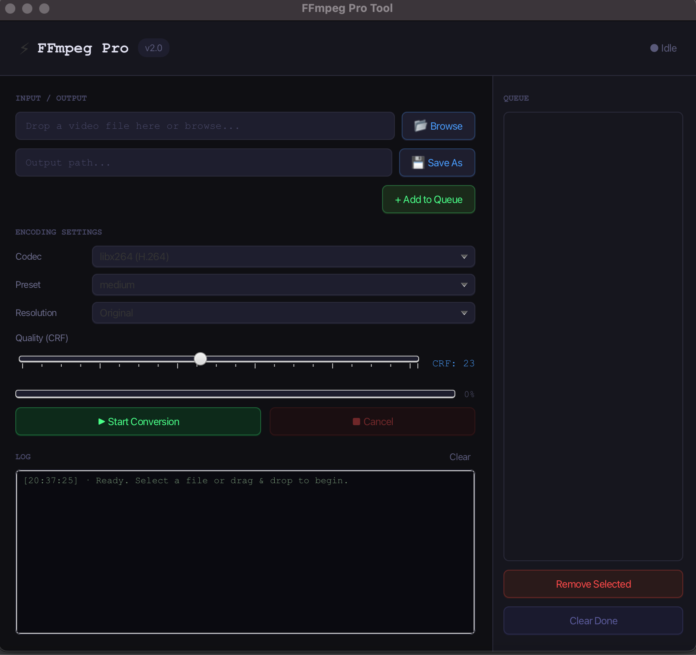

# ⚡ FFmpeg Pro Tool

A modern desktop video conversion application built with **Java + JavaFX + FFmpeg**.

FFmpeg Pro provides an easy-to-use graphical interface for converting videos, controlling encoding quality, resizing videos, managing multiple conversion jobs, and monitoring progress in real time.



## ✨ Features

- 🎬 Video conversion using FFmpeg
- 🖱️ Drag & Drop video files
- 📁 Input and output file browser
- 📋 Conversion queue management
- ⚡ Parallel conversion with 2 worker threads
- 📊 Real-time conversion progress
- ❌ Cancel running conversions
- 📝 Real-time FFmpeg logs
- 🎚️ CRF quality control
- 📐 Video resolution scaling
- 🎞️ Multiple video codecs
- 🚀 Encoding preset selection
- 🔍 Automatic FFmpeg detection
- 🌙 Dark-themed JavaFX interface
- 🧹 Clear completed/failed queue items

## 🎥 Supported Codecs

| Codec | Description |
|---|---|
| `libx264` | H.264 |
| `libx265` | H.265 / HEVC |
| `libvpx-vp9` | VP9 |
| `copy` | No re-encoding |

## 🎚️ Encoding Settings

### Presets

Supports:

`ultrafast` · `superfast` · `veryfast` · `faster` · `fast` · `medium` · `slow` · `slower` · `veryslow`

### CRF Quality

CRF range: **0–51**

| CRF | Quality |
|---:|---|
| 0–18 | Lossless / Very High |
| 19–23 | High |
| 24–28 | Medium |
| 29–35 | Low |
| 36–51 | Very Low |

### Resolution

- Original
- 3840×2160 — 4K
- 1920×1080 — 1080p
- 1280×720 — 720p
- 854×480 — 480p
- 640×360 — 360p

## 📂 Supported Input Formats

- MP4
- MKV
- AVI
- MOV
- WMV
- FLV
- WebM
- M4V
- TS
- MTS

Output formats include:

- MP4
- MKV
- WebM

## 📋 Conversion Queue

Each conversion can have one of these statuses:

- ⏳ PENDING
- 🔄 RUNNING
- ✓ DONE
- ✗ ERROR
- ⛔ CANCELLED

Queue controls allow you to:

- Add multiple videos
- Remove pending jobs
- Clear completed/failed/cancelled jobs
- Process multiple jobs concurrently

## 📊 Real-Time Progress

During conversion, the application reads FFmpeg output and detects the current processing time to calculate:

- Conversion percentage
- Current FFmpeg activity
- Conversion status
- FFmpeg command/log output

## ❌ Cancellation

Running FFmpeg processes can be cancelled directly from the application. The active process is terminated and the queue item is marked as `CANCELLED`.

## 🖱️ Drag & Drop

Video files can be dragged directly into the input area.

The application automatically:

1. Detects the dropped video.
2. Sets it as the input file.
3. Suggests an output filename.
4. Prepares it for queueing.

## 🔍 FFmpeg Detection

The application automatically searches for FFmpeg:

1. From the system `PATH`
2. `./ffmpeg/ffmpeg`
3. `.\ffmpeg\ffmpeg.exe`

If FFmpeg cannot be found, the application displays an error message.

## 🛠️ Technology Stack

- **Java**
- **JavaFX**
- **FFmpeg**
- **Maven**
- Java `ExecutorService`
- JavaFX `Task`
- JavaFX Collections

## 📋 Requirements

- Java 17+ recommended
- Maven
- FFmpeg installed and available in `PATH`, or placed in the project's `ffmpeg` directory

## 🚀 Run the Project

Clone the repository and enter the project directory:

```bash
git clone https://github.com/RavendraDotJava/media-Converter-using-java.git
cd media-Converter-using-java
